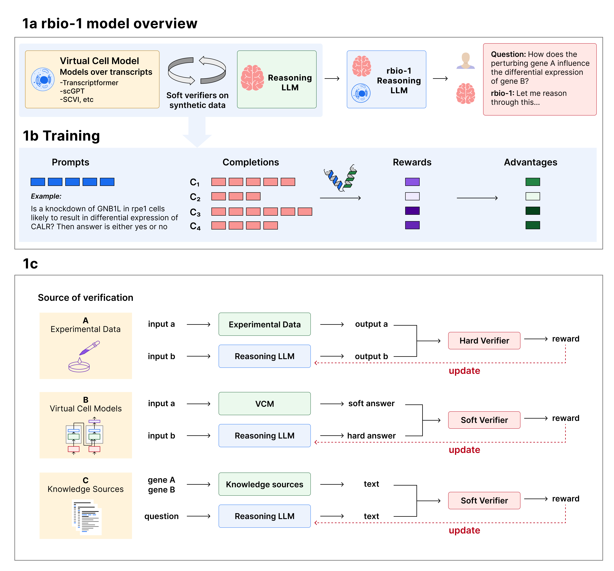

# rbio-1

rbio-1 is a reasoning model that was trained using predictions from Virtual Cell Models (VCMs) as soft verification during training. 

The Rbio model is based on Qwen2.5-3B-Instruct, which is licensed under the [Qwen Research License](https://huggingface.co/Qwen/Qwen2.5-3B-Instruct/blob/main/LICENSE). All modifications and further developments by CZI are released under the MIT License.

## Citation
The preprint pdf can be found under: [rbio-1.pdf](https://github.com/czi-ai/rbio/blob/main/rbio-1.pdf)

Ana-Maria Istrate, Fausto Milletari, Fabrizio Castrotorres, Jakub Tomczak, Michaela Torkar, Donghui Li, Theofanis Karaletsos. rbio-1 - training scientific reasoning LLMs with biological world models as soft verifiers (2025) bioRxiv. DOI: https://doi.org/10.1101/2025.08.18.670981



## Model Variants
Rbio includes several variants based on the type of data or model used as a verifier during reinforcement learning.
Model Variant Name | Task, Purpose, or Description | Access URL or AWS Download link
| - | - | - |
Rbio1-EXP | Post-trained using direct experimental data as a "hard verifier” for maximum accuracy on related tasks. | s3://czi-rbio/rbio1-EXP/
Rbio1-MLP | Post-trained using a task-specific MLP as a "soft verifier”, demonstrating knowledge transfer from a smaller world model. | s3://czi-rbio/rbio1-MLP/
Rbio1-TF | Post-trained using signals (e.g., PMI scores) from the Transcriptformer foundation model as a “soft verifier”. | s3://czi-rbio/rbio1-TF/
Rbio1-GO | Post-trained using the Gene Ontology (GO) knowledge base as a “soft verifier” guiding the model with established biological facts. | s3://czi-rbio/rbio1-GO/
Rbio1-GO-C | Post-trained using the Gene Ontology (GO) knowledge base as a “soft verifier” guiding the model with established biological facts via Rouge-C metric. | s3://czi-rbio/rbio1-GO-C/
Rbio1-GO-F | Post-trained using the Gene Ontology (GO) knowledge base as a “soft verifier” guiding the model with established biological facts via Rouge-F metric. | s3://czi-rbio/rbio1-GO-F/
Rbio1-GO+EXP | Post-trained using both experimental data acting as a “hard verifier” on the task at hand and Gene Ontology (GO) knowledge base as a “soft verifier” for biological facts consistency. | s3://czi-rbio/rbio1-GO+EXP/
Rbio1-TF+EXP | Post-trained using both experimental data acting as a “hard verifier” on the task at hand and Transcriptformer foundation model as “soft verifier” using PMI scores. | s3://czi-rbio/rbio1-TF+EXP/
Rbio1-TF+GO+EXP | Post-trained using: experimental data acting as a “hard verifier” on the task at hand; Transcriptformer foundation model as “soft verifier” using PMI scores; and Gene Ontology (GO) knowledge base as a “soft verifier” for biological facts consistency. | s3://czi-rbio/rbio1-TF+GO+EXP/
Rbio1-TF+GO+MLP | Post-trained using: an MLP acting as a "soft verifier” of world-knowledge as seen through the lens of a smaller model; Transcriptformer foundation model as “soft verifier” using PMI scores; and Gene Ontology (GO) knowledge base as a “soft verifier” for biological facts consistency/ | s3://czi-rbio/rbio1-TF+GO+MLP/
Rbio1-TF+GO+MLP+EXP | Post-trained using: experimental data acting as a “hard verifier” on the task at hand; Transcriptformer foundation model as “soft verifier” using PMI scores; Gene Ontology (GO) knowledge base as a “soft verifier” for biological facts consistency; and MLP as a "soft verifier” of world-knowledge as rendered via a smaller model. | s3://czi-rbio/rbio1-TF+GO+MLP+EXP/

## Usage

We recommend creating a virtual env with:

```
python3 -m venv rbio-env
source rbio-env/bin/activate
pip3 install -r requirements.txt
```

### 1. Inference Scripts
The inference scripts will run an rbio model version on a list of user-provided questions. The script will automatically download the model weights from AWS S3. 

The model arguments are:

| argument | description | default_value |
| - | - | - |
| base_model_name | base model name | Qwen/Qwen2.5-3B-Instruct |
| rbio_model_ckpt | rbio_model_variation | rbio_TF_ckpt 
| results_output_folder | optional folder where to save the results | predictions |
| results_output_filename | optional filename for the results |results.csv |


### 2. Training Scripts
The training scripts demonstrate a minimal example of RBIO training with soft verification. This implementation uses soft verification against a simplified biological perturbation model based on a multi-layer perceptron (MLP).
For detailed instructions on running the training pipeline, see the README.md file in the `training/` subdirectory.

## Code of Conduct

This project adheres to the Contributor Covenant [code of conduct](https://github.com/chanzuckerberg/.github/blob/master/CODE_OF_CONDUCT.md). By participating, you are expected to uphold this code. Please report unacceptable behavior to [opensource@chanzuckerberg.com](mailto:opensource@chanzuckerberg.com).

## Reporting Security Issues

If you believe you have found a security issue, please responsibly disclose by contacting us at [security@chanzuckerberg.com](mailto:security@chanzuckerberg.com).
